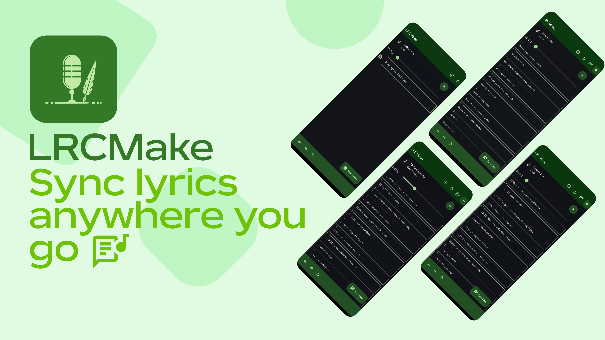

# LRCMake

### What is LRCMake

LRCMake is the app written in python using [Flet](https://github.com/flet-dev/flet) framework.
LRCMake is used for syncing lyrics for future contributing it to various resources, especially [LRCLIB](https://lrclib.net), or just for your local files, if you prefer to store it locally.

Right now LRCMake support only exporting synced lyrics to clipboard, but it's not forever. In my plans is to enlarge export options to `.lrc` files and to direct uploading synced lyrics to [LRCLIB](https://lrclib.net/docs), so stay tuned.

## Installation

Despite the fact that LRCMake is the app, it currently doesn't have `.apk` file...

Just because when I compile it, it's just a blank screen.
If you can compile it without blank screen, contact me through PR, Issue or Discussion

The only way I know how to launch it is [Flet's app](https://play.google.com/store/apps/details?id=com.appveyor.flet) using [Termux](https://f-droid.org/ru/packages/com.termux/), so this instruction is for Termux and Flet's app.
>[!CAUTION]
>This method requires root, if you want to see songs metadata

1. Install [Flet's app from Google Play](https://play.google.com/store/apps/details?id=com.appveyor.flet) and [Termux from F-Droid](https://f-droid.org/ru/packages/com.termux/)
2. Install Python 3.11.10, Rust and PIP from Termux
3. Clone this repo in any directory you frefer to
    1.  Go to this directory
4. Create the Python venv here using `python3.11 -m venv .venv`
5. Then execute `source .venv/bin/activate` to activate environment
6. Execute `pip install -r requirements.txt` to install needed dependencies
    1. If it's unable to install some of them, look into the errors you've got during installation, the answers is in there
7. Run app by `sudo flet run --android`
8. To open app in Flet's app you need to scan QR-code you've got after running the app
>[!TIP]
> You need to make this with `sudo` because if you wouldn't, it will error with Permission Denied to read selected song metadata